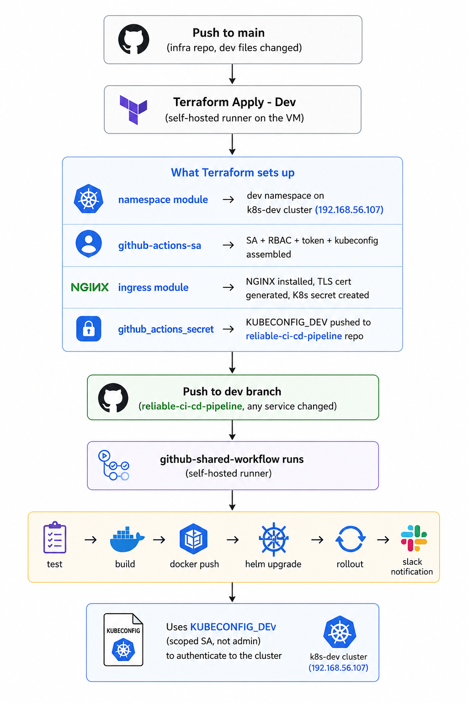

# devops-infrastructure-terraform


Terraform infrastructure for the `reliable-ci-cd-pipeline` monorepo. Provisions Kubernetes namespaces, RBAC, NGINX Ingress Controller, TLS certificates, and GitHub Actions credentials across three environments: `local`, `dev`, and `prod`.

---

## What This Repo Does

Instead of running `kubectl create namespace`, `kubectl apply -f nginx-ingress.yaml`, and `openssl req` by hand on each cluster, all infrastructure is declared in Terraform and applied automatically through GitHub Actions. A single `git push` to `main` provisions or updates the full environment.

After each apply, the scoped kubeconfig for the `github-actions` ServiceAccount is pushed directly to the `reliable-ci-cd-pipeline` repository as `KUBECONFIG_DEV` or `KUBECONFIG_PROD`, no manual copy-paste required.

---

## Architecture

### Environments

| Environment | Cluster | IP | Managed by |
|---|---|---|---|
| `local` | Docker Desktop (Windows) | localhost | Terraform (manual apply) |
| `dev` | VM1: k8s-dev | 192.168.56.107 | Terraform (CI apply) |
| `prod` | VM2: k8s-prod | 192.168.56.108 | Terraform (CI apply) |

### State Backend

Terraform state is stored in **HashiCorp Consul**, running on a VM (`192.168.56.102`). Each environment has its own key in Consul's KV store:

| Environment | Consul key |
|---|---|
| dev | `terraform/dev` |
| prod | `terraform/prod` |

Consul ACLs are enabled, Terraform authenticates with a scoped token that can only read/write the `terraform/` key prefix. The root Consul token is never used in CI.

### Runner

All CI jobs run on a **self-hosted GitHub Actions runner**. Since the runner is on the same private network as the clusters and Consul, no VPN or tunnel is needed.

---

## Project Structure

```
devops-infrastructure-terraform/
├── .gitignore
├── modules/
│   ├── namespace/           # Creates one namespace named after the environment
│   ├── github-actions-sa/   # Creates SA, RBAC, token, and assembles kubeconfig
│   └── ingress/             # Installs NGINX via Helm + generates TLS cert + K8s secret
└── environments/
    ├── local/               # Docker Desktop, manual apply only
    │   └── main.tf
    ├── dev/
    │   ├── main.tf          # Calls all modules + pushes KUBECONFIG_DEV to GitHub
    │   └── backend.tf       # Consul backend, path: terraform/dev
    └── prod/
        ├── main.tf          # Calls all modules + pushes KUBECONFIG_PROD to GitHub
        └── backend.tf       # Consul backend, path: terraform/prod
```

Modules hold the logic. Environment folders hold the configuration. How a resource is created lives once in the module, called from each environment with different values.

---

## Modules

### `namespace`

Creates a single Kubernetes namespace named after the environment, with `environment` and `managed-by=terraform` labels.

Replaces: `kubectl create namespace dev`

### `github-actions-sa`

Creates four Kubernetes resources in order:

1. **ServiceAccount** (`github-actions`): the identity CI uses to deploy
2. **ClusterRole**: defines what the SA is allowed to do (deploy resources in the app namespace, create namespaces as a safety net for the shared workflow's fallback step)
3. **RoleBinding**: grants the ClusterRole to the SA, scoped to the app namespace
4. **Secret** (token type): generates a long-lived login token for the SA

Then assembles all three pieces (cluster URL + CA cert + token) into a complete kubeconfig YAML string and exposes it as a sensitive Terraform output.

Replaces: manual `kubectl` SA creation + manual kubeconfig file assembly

### `ingress`

Three jobs in one module:

1. **NGINX Ingress Controller** via Helm (`ingress-nginx` chart, version `4.10.1`) with `hostNetwork: true` so it binds directly to ports 80 and 443 on the node IP: no LoadBalancer needed on bare metal.

2. **TLS private key + self-signed certificate** via the `tls` provider, covering all domains for that environment as Subject Alternative Names.

3. **Kubernetes TLS secret** (`kubernetes.io/tls` type) storing the generated cert and key, named `bookstore-dev-tls` or `bookstore-prod-tls`, exactly what the Helm chart's ingress resources reference.

Replaces: `kubectl apply -f baremetal/deploy.yaml` + manual `kubectl patch` for hostNetwork + `openssl req -x509` + `kubectl create secret tls`

---

## How Environments Work

Each environment folder has a `main.tf` that:
- Declares which providers to use and how to connect to that cluster
- Calls the shared modules with environment-specific values (domain names, secret names, cert SANs)
- Contains one inline `github_actions_secret` resource that pushes its own kubeconfig to GitHub

The `local` environment only runs the `namespace` module, it never runs from CI and doesn't need ingress or a GitHub SA since deployments to Docker Desktop are manual.

Dev and prod are identical in structure, only the cluster IP, domain names, secret names, and TLS cert SANs differ.

---

## Two Identities

| Identity | Used by | Purpose |
|---|---|---|
| Admin kubeconfig (`~/.kube/dev/config`) | Terraform | Creates namespaces, SA, RBAC, installs NGINX |
| `github-actions` SA (Terraform output) | `github-shared-workflow` | Deploys application code via Helm |

Terraform uses the admin kubeconfig (stored as `DEV_ADMIN_KUBECONFIG` / `PROD_ADMIN_KUBECONFIG` in the infra repo's secrets) to provision everything. The `github-actions` SA it creates is a weaker identity, scoped to one namespace that gets handed to the CI/CD pipeline. Admin credentials never enter the app pipeline.

---

## CI/CD Workflows

Two workflow files live in `.github/workflows/`:

- `terraform-dev.yml`: triggers on push to `main` when `environments/dev/**` or `modules/**` change
- `terraform-prod.yml`: triggers on push to `main` when `environments/prod/**` or `modules/**` change

Each workflow:
1. Writes the admin kubeconfig to disk from a GitHub Secret
2. Runs `terraform init`: connects to the Consul backend and downloads providers
3. Runs `terraform plan`: shows what will change
4. Runs `terraform apply -auto-approve`: applies changes and pushes the updated kubeconfig to GitHub

After apply, the `github_actions_secret` resource in each environment's `main.tf` automatically updates `KUBECONFIG_DEV` or `KUBECONFIG_PROD` in the `reliable-ci-cd-pipeline` repository via the GitHub provider. No manual step required.

---

## Secrets

| Secret | Purpose |
|---|---|
| `CONSUL_HTTP_TOKEN` | Scoped Consul token for reading/writing Terraform state |
| `DEV_ADMIN_KUBECONFIG` | Admin kubeconfig for the dev cluster, used by Terraform's Kubernetes provider |
| `PROD_ADMIN_KUBECONFIG` | Admin kubeconfig for the prod cluster, used by Terraform's Kubernetes provider |
| `DEV_CLUSTER_API_SERVER` | Dev cluster API server URL, passed as `TF_VAR_cluster_api_server` |
| `DEV_CLUSTER_CA_CERT` | Dev cluster CA cert (base64), passed as `TF_VAR_cluster_ca_cert` |
| `PROD_CLUSTER_API_SERVER` | Prod cluster API server URL |
| `PROD_CLUSTER_CA_CERT` | Prod cluster CA cert (base64) |
| `GITHUB_PAT` | Personal Access Token with `repo` scope, used to push kubeconfig secrets to the monorepo |

`DEV_ADMIN_KUBECONFIG` and `PROD_ADMIN_KUBECONFIG` are full admin kubeconfigs. They stay in the infra repo only and never appear in the application pipeline.

---

## Providers Used

| Provider | Purpose |
|---|---|
| `hashicorp/kubernetes` | Manages namespaces, service accounts, RBAC, secrets |
| `hashicorp/helm` | Installs NGINX Ingress Controller |
| `hashicorp/tls` | Generates private keys and self-signed certificates |
| `integrations/github` | Pushes kubeconfig secrets to the monorepo |

---

## Full Automated Flow



---

## Consul State Backend

Consul runs on the VM (`192.168.56.102:8500`) as a systemd service, installed via the official HashiCorp apt repository. ACLs are enabled with `default_policy = deny`, anonymous requests are rejected.

Terraform authenticates with a scoped token that has write access only to the `terraform/` key prefix and session creation for state locking. The root Consul token is never used outside of initial setup.

State locking is enabled (`lock = true` in `backend.tf`), if two applies run simultaneously, the second waits for the lock to be released rather than corrupting state.

To verify state is stored correctly after an apply:

```bash
export CONSUL_HTTP_TOKEN=<terraform-token>
consul kv get terraform/dev
consul kv get terraform/prod
```

Both commands should return a JSON blob containing the current Terraform state.

---

## Running Locally

Credentials are never hardcoded, added as environment variables before applying:

```bash
# Dev
export CONSUL_HTTP_TOKEN=<terraform-token>
export GITHUB_TOKEN=<personal-access-token>
export TF_VAR_cluster_api_server=<cluster-api-url>
export TF_VAR_cluster_ca_cert=<base64-ca-cert>

cd environments/dev
terraform init
terraform plan
terraform apply
```

The `local` environment needs none of these, it connects to Docker Desktop directly and uses local state:

```bash
cd environments/local
terraform init
terraform plan
terraform apply
```

---

## Related Repositories

| Repository | Purpose |
|---|---|
| [reliable-ci-cd-pipeline](https://github.com/rouisskhawla/reliable-ci-cd-pipeline) | Monorepo: application code and GitHub Actions workflow callers |
| [github-shared-workflow](https://github.com/rouisskhawla/github-shared-workflow) | Reusable GitHub Actions pipeline used by all services |
| [jenkins-shared-library](https://github.com/rouisskhawla/jenkins-shared-library) | Equivalent shared pipeline for Jenkins |
| [gitlab-shared-template](https://github.com/rouisskhawla/gitlab-shared-template) | Equivalent shared pipeline for GitLab CI |